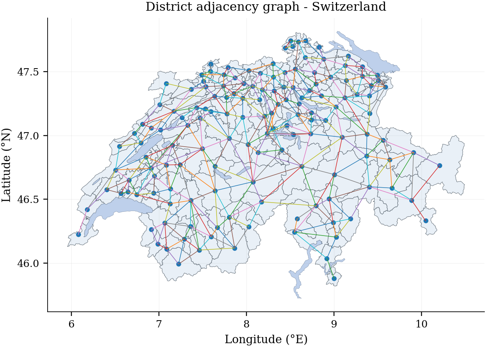
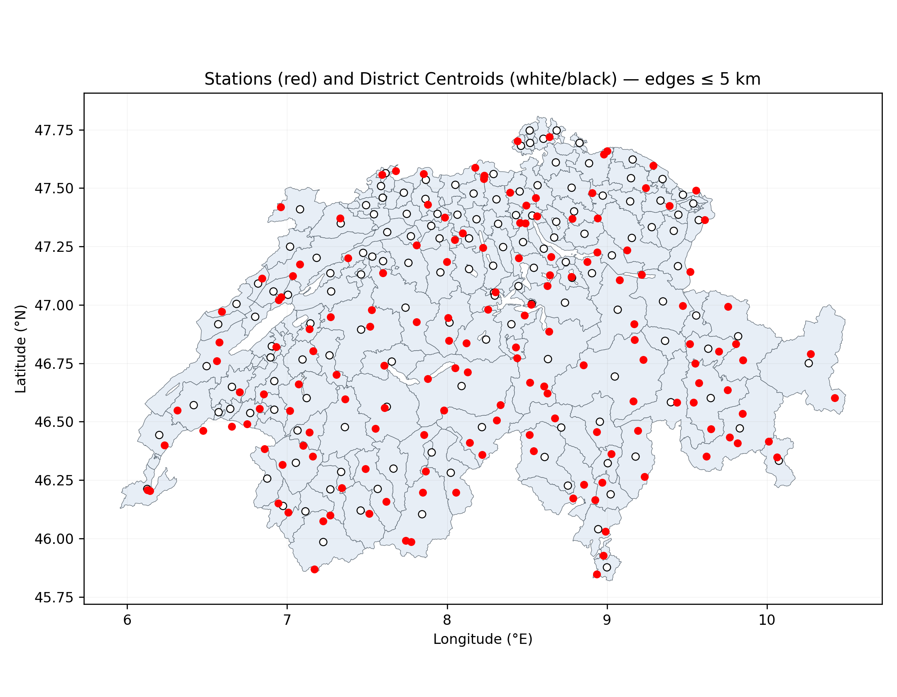
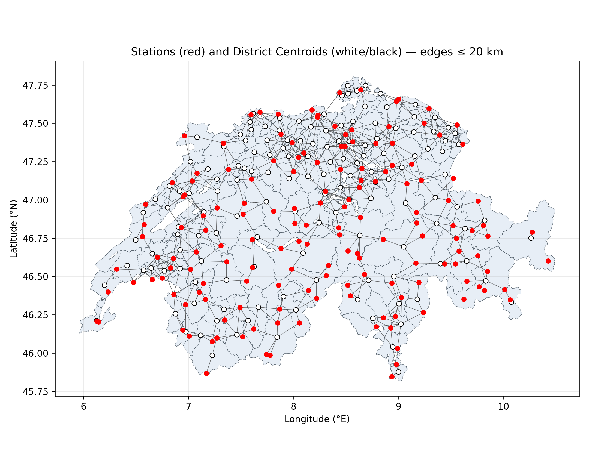
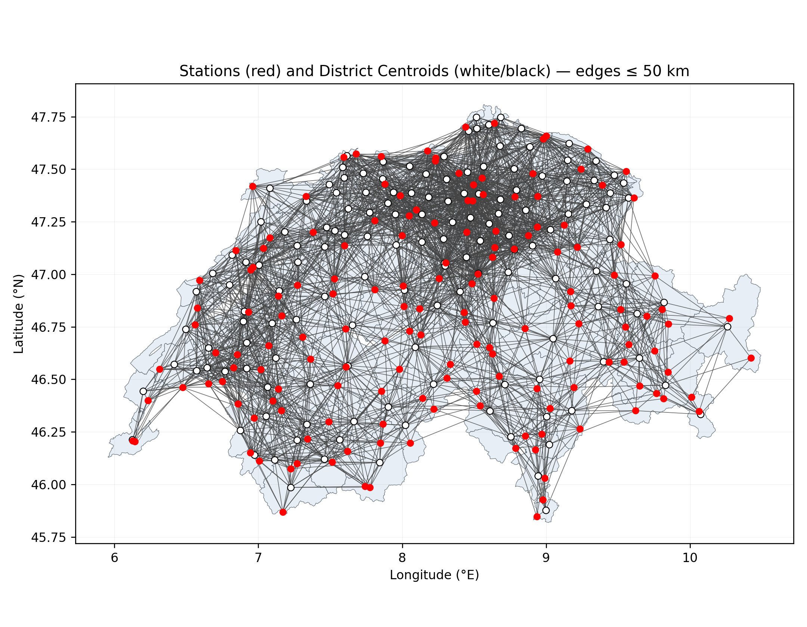
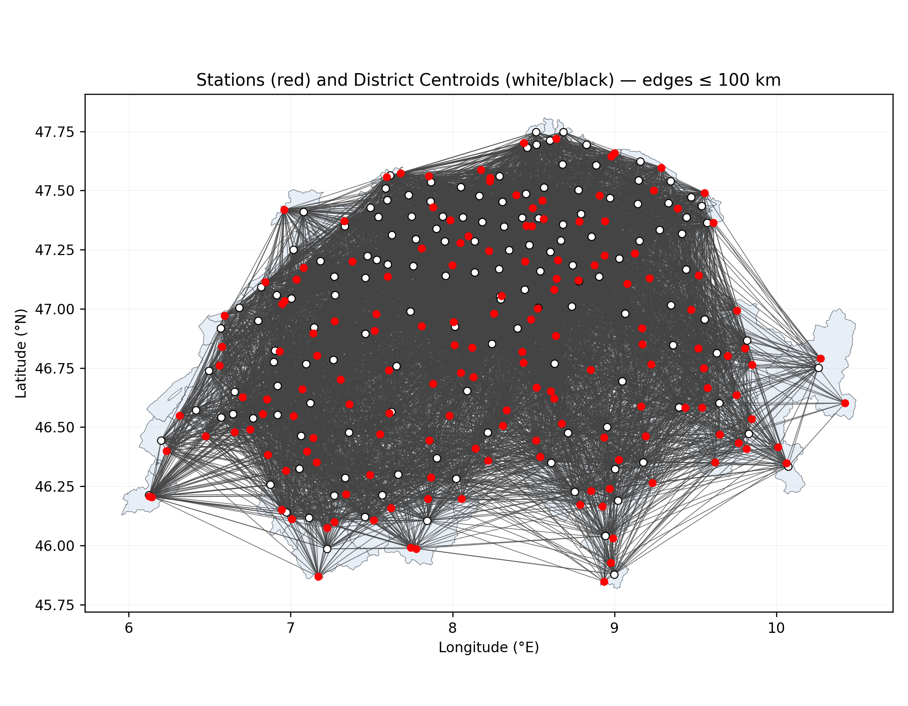

# MyMeteo

[MeteoSwiss](https://www.meteoswiss.admin.ch/about-us/) is gradually releasing its data in an **OpenData**, machine-readable format.  
Inspired by the complexity of the field and the precision achieved by MeteoSwiss, this repo is an end-to-end attempt to model meteorological data and build a personal climate predictor.

---

> ⚠️ **Disclaimer:** This project is a **personal exercise** in ML and coding.  
> Any other use or interpretation is outside my responsibility.

---

## Idea
I don’t know how MeteoSwiss tackles the problem and I don’t have their full data or compute.  
Everything here is **built from scratch**. If external methods/datasets are added, they’ll be documented explicitly.

## Graph Representation

A key feature is a **graph of Swiss districts** and a **graph of meteorological stations**.  
The workflow:
- Build an adjacency graph of Swiss administrative areas (district level for now).
- Bind district centroids to nearby meteo stations using great-circle distances.
- Let the model learn spatial dependencies and propagate meteo signals over the graph.

---

## Predictions
Current targets:
- **Next hour**
- **Current day** (08:00 → 07:59 next day)
- **Next 5 days**

Variables:
- Temperature
- Humidity
- Sunlight duration

Each prediction includes **auxiliary estimates** and **uncertainty scores**.

---

## Results
- **158** ground stations (daily aggregates: e.g., min/max temp, etc.)
- **148** Swiss districts (graph nodes are district centroids)

**Station–district links by radius (km)**

| Radius (km) | # Links |
|---:|---:|
| 5  | 45 |
| 20 | 641 |
| 50 | 3,341 |
| 100| 10,090 |

  <figure style="display:inline-block; margin:4px;">
    
    <figcaption align="center">≤ 5 km</figcaption>
  </figure>
  <figure style="display:inline-block; margin:4px;">
    
    <figcaption align="center">≤ 20 km</figcaption>
  </figure>

  <figure style="display:inline-block; margin:4px;">
    
    <figcaption align="center">≤ 50 km</figcaption>
  </figure>
  <figure style="display:inline-block; margin:4px;">
    
    <figcaption align="center">≤ 100 km</figcaption>
  </figure>

---

## Versions
- [ ] v.0.0.0: District level predictions of next hour weather conditions
- [ ] v.0.1.0: District and cantonal prediction of next hour and next day
- [ ] v.0.1.0: District, cantonal prediction of next hour, next day, next 5 days
- [ ] v.1.0.0: Municipal, district, cantonal and PLZ prediction of next hour, day and 5 days

---

## External data citations

- GeoJsons of Switzerland: [[mikpan]](https://github.com/mikpan/ch-maps/tree/master)
