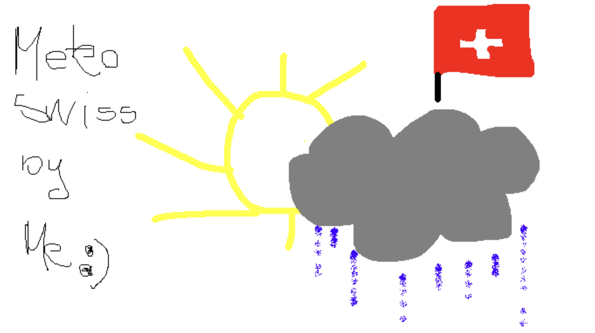

# MyMeteo

[MeteoSwiss](https://www.meteoswiss.admin.ch/about-us/) is gradually releasing its data in an **OpenData**, machine-readable format.  
Inspired by the complexity of the field, the impressive precision achieved by [MeteoSwiss](https://www.meteoswiss.admin.ch/about-us/), and as a Machine Learning enthusiast, I decided to take on the challenge of modeling meteorological data to build my own personal climate predictor.

---

> ⚠️ **Disclaimer:** This project is **just my personal exercise in Machine Learning and coding**.  
> Any other use, interpretation, or outcome is entirely outside my concern and responsibility.

---

## Idea
I have absolutely no idea how MeteoSwiss tackles the problem.  
I also know I don’t have access to all the data they may use, nor the computational power to train such advanced models.  
Everything in this repo is **built from scratch, out of my head**. If I ever integrate external methods or datasets, I’ll explicitly document it.

## Graph Representation
A key feature of this project is the **graph-based relationship among meteorological stations** based on their spatial coordinates.  

The approach is to:  
- Build a graph representation of Swiss localities.  
- Bind them to a separate graph of meteorological stations.  
- Let the model learn local relationships (geological, cantonal, communal, and city-wise) and connect them to meteo stations.

---

## Predictions
For the moment, the target is to produce predictions at three different ranges:  
- **Next hour**  
- **Current day** (from 8:00 am to 7:59 am the next day)  
- **Next 5 days**

The model aims to estimate the following parameters: 
- Temperature  
- Humidity  
- Sunlight duration  

Each prediction will also include **secondary estimates** and **probability scores** for each parameter.
